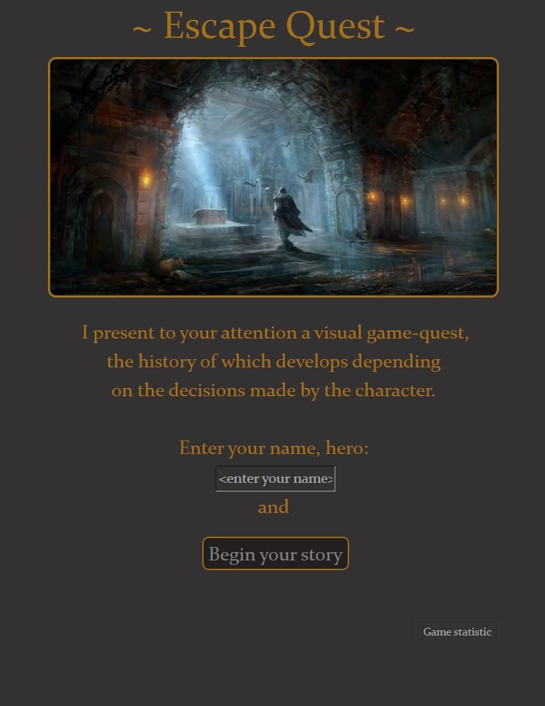
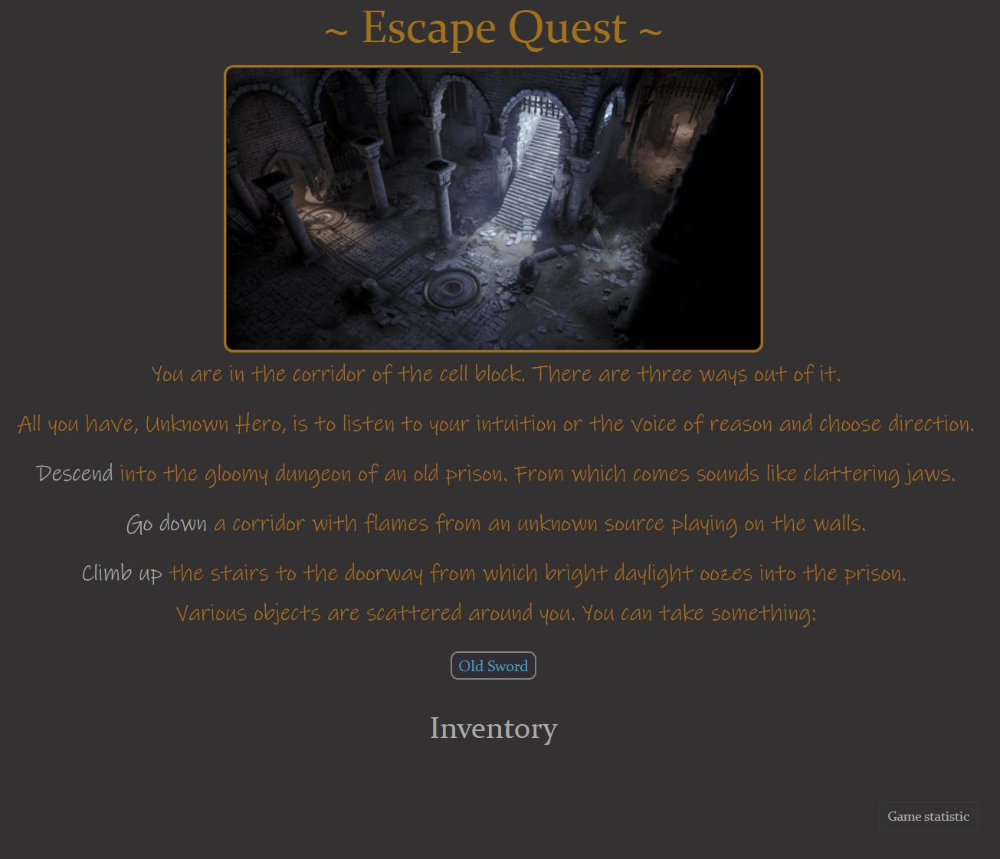

# **Escape Quest**
___

### Description
Web application "Escape Quest" - is a text game quest, the history of which develops depending on the player’s 
decisions. The main goal of the game is to get out of the dungeon. It can be achieved in several ways: to go the right 
way or to use the right item in the battle with the boss. There are different endings in the game.

_Game Options:_
- create a character with a given name;
- move freely in locations (if this is allowed);
- collect objects scattered on locations;
- use the found items in the boss fight;
- replay the game after winning or losing.
___
### Warnings
Some locations feature sounds and animated screamers.
___
### Restrictions
Game session lasts 30 minutes after which game data will be lost.
___
### Application launch
**_1 way - Follow the link:_** https://tek.fly.dev/escape_quest/

**_2 way - Run on your local computer:_** `escape_quest.war` file in the `dist` project directory should be 
deployed into tomcat 9 version. Then use context to run: http://localhost:8080/escape_quest/
___
### Class description
The package `configuration` contains the classes:
- `ItemProperties` - describes the properties of game items;
- `LocationProperties` - describes the properties of game locations;
- `ModelConfig` - class containing arrays of properties of items and locations.

The package `constant` contains the classes:
- `CharacterRules` - contains the default characteristics of the character;
- `LocationRules` - contains lists of locations where special rules apply;
- `ResourceFilesPath` - paths to _**.json**_ files that contain information for creating locations and items.

The package `model` contains the classes:
- `Character`, `Location`, `Item` - classes of appropriate game models.

The package `repository` contains the class:
- `GameRepository` - Class for storing game data(locations, items, characters).

The package `service` contains the classes:
- `GameConstructor` - creates character, locations Map and items Map;
- `GameMaster` - manages game mechanics and models;
- `ResourceLoader` - class to load game resources from **_.json_** files.

The package `servlet` contains the classes:
- `AppContextListener` - creates attribute that stores an instance of the GameMaster class for further application management;
- `BossFight` - servlet receives an itemId from the Get request and uses it in the boss fight;
- `GameRestart` - reset game characteristics to default. Starting a new game session;
- `GameStart` - servlet displays the "welcome page". Creates game locations, items and character;
- `ItemServlet` - provides interaction with game items;
- `LocationFilter` - sets additional rules and attributes on specific locations;
- `LocationServlet` - assembles a location to display it on a page with all the necessary elements. 
___
### Resource description
The directory `resources` contains **_.json_** files for creating locations and items.
___
### Test class
The package `test` contains classes for testing:
- GameConstructorTest
- GameMasterTest
- ResourceLoaderTest
___
### Webapp description
The directory `webapp` contains:
- `index.jsp` - the main single page on which the game will take place. Contains all elements of the game (such as 
inventory, items in the location, etc.) necessary for display.
- `view` - contains jsp pages-locations with a specific design that will be integrated into the main index.jsp 
page via servlets.
- `sound` - contains **_.mp3_** files for the game.
- `image` - contains **_.jpg_** and **_.gif_** files for the game.
- `css` - contains **_bootstrap.min.css_** and **_page.css_** with manual settings for game style. 
___
### **Screenshots**

